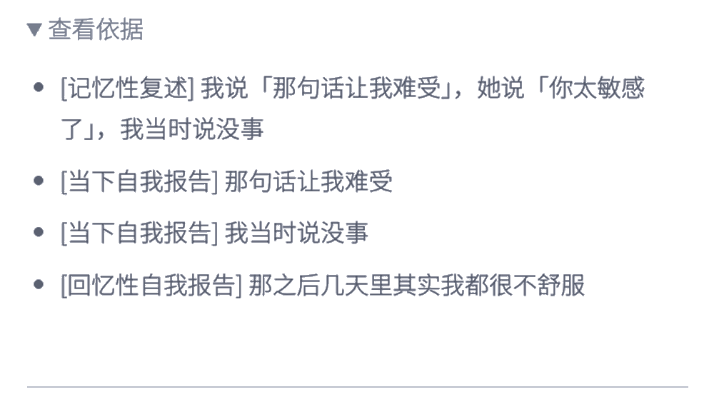

# 照见 · 认知澄清智能体

**一个以评测体系为核心的 AI 产品项目**：关系情境下的证据整理与决策支持。输入一段对互动的描述，输出关系模式分析、可执行的应对话术与冷却提醒。

个人 MVP 项目，本人独立完成**评测体系构建**（黄金用例集、硬/软指标分级验收、三方对照回归、bad case 归因）以及产品设计、Prompt 工程、后端、前端与测试评估全流程（与 Claude Code / Codex 人机协作开发：人定义问题与边界，结论以评测证据为准）。

> **声明**：本仓库为公开作品集展示版，提供交互演示、脱敏案例与评测方法说明。演示使用预设结果，不包含完整系统提示词、核心判定规则及私有评测数据，不代表完整可运行版本。

## 定位三条

- **可拆解的证据卡**：把叙述拆成证据项，逐条标注内容、来源、证据状态，并附原始依据

  

  *真实运行输出，输入为虚构场景*

- **可核查的矛盾与待确认问题**：证据之间的冲突被显式标出（真矛盾 / 程度差距 / 边界未定），每个待确认问题写明"回答会如何改变当前判断"
- **有边界的应对话术与安全行动**：给出可直接使用的话术；命中安全关注时，仲裁逻辑覆盖结论，改为不依赖动机判断的低风险选项

## Why

一次关系互动之后，人通常记得三样东西：对方最难听的那半句话，自己当时没说出口的最佳回答，以及一个越想越像事实的推测。实际发生了什么，往往排在第四位。叙述碎片化、可能自相矛盾，也容易被安慰、迎合或过度解读带偏。

## 评测体系（本项目的核心）

围绕"评测结果可信、稳定、可复现"设计，而非只看输出"看起来对"：

- **黄金用例集**：旧版基线 19 条（19/19 通过）+ 新版候选 20 条，预期结果逐条独立标注核验，不沿用旧版预期以防污染；覆盖事实 / 转述 / 情感 / 推测四层分类。
- **硬指标与软指标分级验收**：硬指标不可回退——安全关注漏标率红线 ≤10%，V1 在 20 个边界案例上实测 **0%**；软指标（矛盾子类型混淆、直接引语来源分类）记录归因、排入迭代。
- **三方对照回归**：旧版基线 - 新版候选 - 仲裁整合版三版本对照（9 条共享案例逐条核查差异），任一版本行为变更都触发全量回归。
- **采样波动统计对照**：官方 SDK 移除确定性采样参数后，以"改动前后差异幅度 vs 同 Prompt 自身波动幅度"的统计对照替代严格确定性复现，规避采样噪声导致的回归误判。
- **bad case 归因机制**：区分系统防护生效（不计为缺陷）、模型行为偏差（记为 bad case）、Prompt 约束问题（迭代 Prompt），以逐条根因分析驱动迭代规划。
- **评估 Dashboard**：仲裁覆盖率、安全提示触发次数、逐案例证据账本明细可视化。

（用例内容与逐条评测结果属私有数据，不随仓库公开；指标口径与方法论如上。）

## 交互演示

无需安装与配置，演示地址： https://plainforge7.github.io/zhaojian-clarify/ （或浏览器直接打开 `index.html`）：

- 内置 2 个脱敏示例，点击"示例 1 / 示例 2"即可一键体验完整交互流程；
- 演示覆盖产品的核心交互：关系模式识别卡片、可直接执行的应对话术、冷却提醒、安全关注提示、仲裁介入说明、证据来源查看、本地历史记录；
- 演示结果为预设数据，仅展示产品形态与交互流程，不代表真实模型输出。

## 架构

新旧两版模型输出并行调用，再由规则仲裁：

- **旧版**：直接输出"识别出的模式 / 应对话术"，判断逻辑封装在 System Prompt 内部，是一个不透明的整体判断。
- **新版（V1.1）**：先输出结构化的 **证据账本**——把用户描述拆解为若干条，每条标注来源（如"记忆性复述"）、证据状态（如"仅用户报告"）、是否涉及安全关注，再输出条目之间的矛盾清单。
- **仲裁**：以旧版的自然语言结果为主要展示内容；当证据账本中出现"涉及安全关注的条目存在矛盾"这类情况时，仲裁逻辑会介入覆盖旧版结论，改为更谨慎的表述，而不是让模型自己判断要不要谨慎。

两个版本通过线程池并行调用，任一版本失败时有兜底降级路径，不让用户空手而归。

## Tool Calling 子项目： `get_history_tool/`

完全独立的小项目，可以直接跑：给 Agent 一个 `get_history(user_id, topic)` 工具，让它在"当前信息不足"时自主决定要不要调用它查历史记录，而不是无脑每次都查或从不查。

- `get_history.py`：Mock 版历史记录查询实现
- `test_cases_get_history.json`：9 个人工设计的测试用例（该调用的、不该调用的、历史为空的）
- `scorer.py`：自动评分器
- `real_agent.py`：接入真实 Claude API 的完整实现（user_id 后端强制注入、模型不可篡改）
- `get_history_score_report.json`：4 轮真实模型调用结果，36 个判定 35 正确（单次 8/9～9/9，黄金集仅 9 例）

运行需要设置 `ANTHROPIC_API_KEY` 环境变量：

```
cd get_history_tool
export ANTHROPIC_API_KEY=你的key
python3 real_agent.py
```

## 本地运行说明

- 交互演示： https://plainforge7.github.io/zhaojian-clarify/ （需仓库 Settings → Pages 开启；或浏览器直接打开 `index.html`），无需后端与 API key；
- `server.py` 等后端代码仅供架构参考：缺少 System Prompt 与仲裁模块，无法直接运行完整系统（有意为之，见下）。

## 未包含的内容

以下内容涉及产品的核心判断逻辑，出于保护考虑未包含在本仓库中：

- 两版 System Prompt 正文（`server.py` 中 `LEGACY_SYSTEM_PROMPT_FILE` 引用的文件，需自行提供同名文件才能跑通）
- 仲裁逻辑模块 `response_arbitration.py`（`server.py` 会 `import` 这个模块，仓库里没有，直接跑会报 `ModuleNotFoundError`，这是有意为之）
- 黄金测试用例集与历次评测结果

也就是说，本仓库展示的是 **系统怎么搭**（架构、编排、评测方法论），不展示 **具体怎么判断**（Prompt 里的规则细节、仲裁的触发条件与文案）。面试/交流中可以现场演示或讲解这部分。

## 目录

```
index.html                     前端交互演示（预设结果，浏览器直接打开）
server.py                      Flask 后端，两个版本的调用编排 + 仲裁触发 + API 路由
json_utils.py                  模型输出的 JSON 宽容解析
run_comparison_v1_1.py         黄金测试集回归测试脚本（新旧版本 + 仲裁一致性核验）
templates/                     评估 Dashboard 模板
get_history_tool/              Tool Calling 能力独立子项目，见上
```
